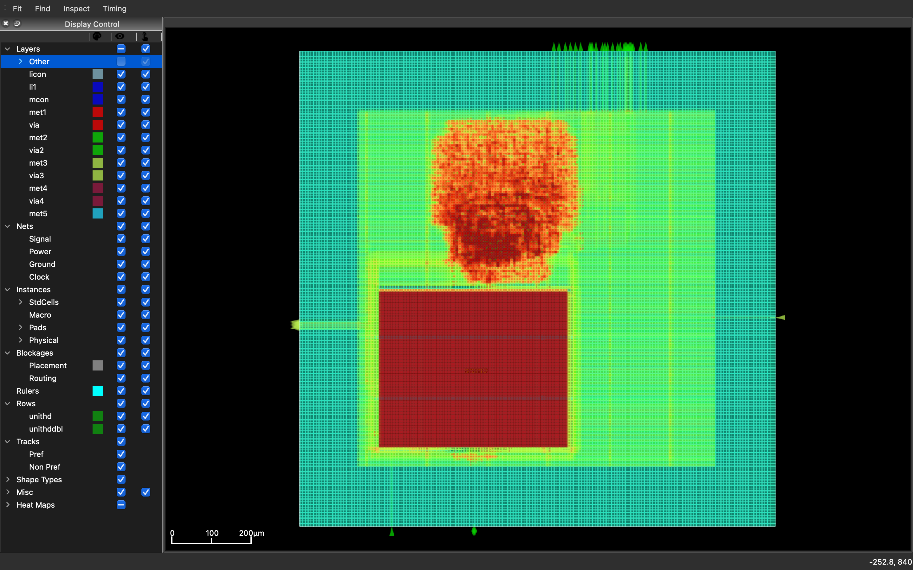

# PicoRV32 + SRAM Physical Design (OpenLane/OpenROAD)

This project demonstrates a complete RTL-to-GDS physical design flow using OpenLane and OpenROAD.

## Design
- CPU: PicoRV32
- Memory: SKY130 SRAM Macro (1KB)
- Technology: SkyWater SKY130

## Design Summary

| Parameter | Value |
|----------|------|
| CPU | PicoRV32 |
| Technology | SKY130 |
| Clock Domains | 1 |
| Clock Frequency | 100 MHz |
| Standard Cells | ~16k |
| SRAM Macros | 1 |
| Flow | OpenLane RTL-to-GDS |

## Flow
RTL → Synthesis → Floorplan → Power Planning → Placement → CTS → Routing → DRC → GDS

## Tools
- OpenLane2
- OpenROAD
- Yosys
- Magic
- KLayout

## Results
- Standard cells: ~6673
- Flip-flops: ~1592
- SRAM macros: 1

## Key files
- `soc_top.v` – Top module integrating CPU + SRAM
- `config.json` – OpenLane flow configuration
- `macro_placement.cfg` – SRAM floorplanning
- `constraint.sdc` – Timing constraints

## Layout
Generated layout shows SRAM macro placement with CPU logic placed above it.

## Final Layout

RTL-to-GDS physical design of a PicoRV32 CPU integrated with a SKY130 SRAM macro using OpenLane/OpenROAD.

## Author
Rahul Nautiyal
