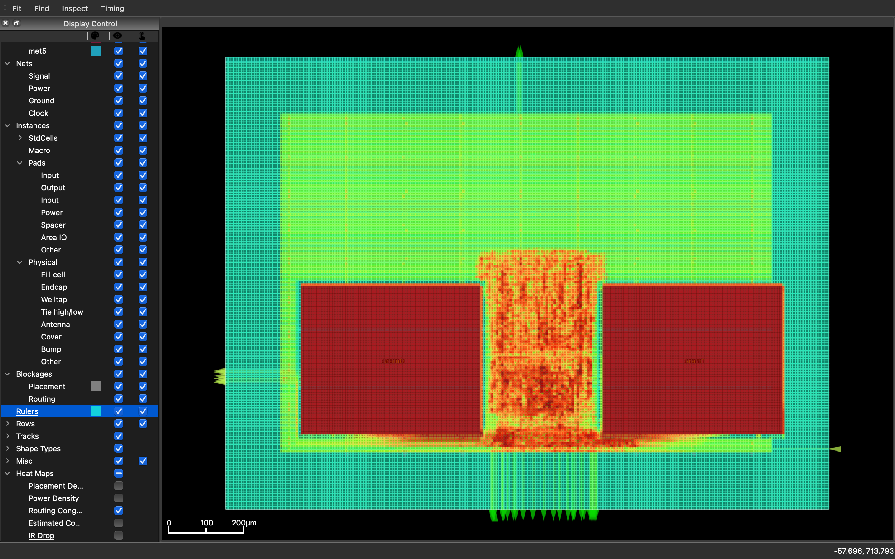
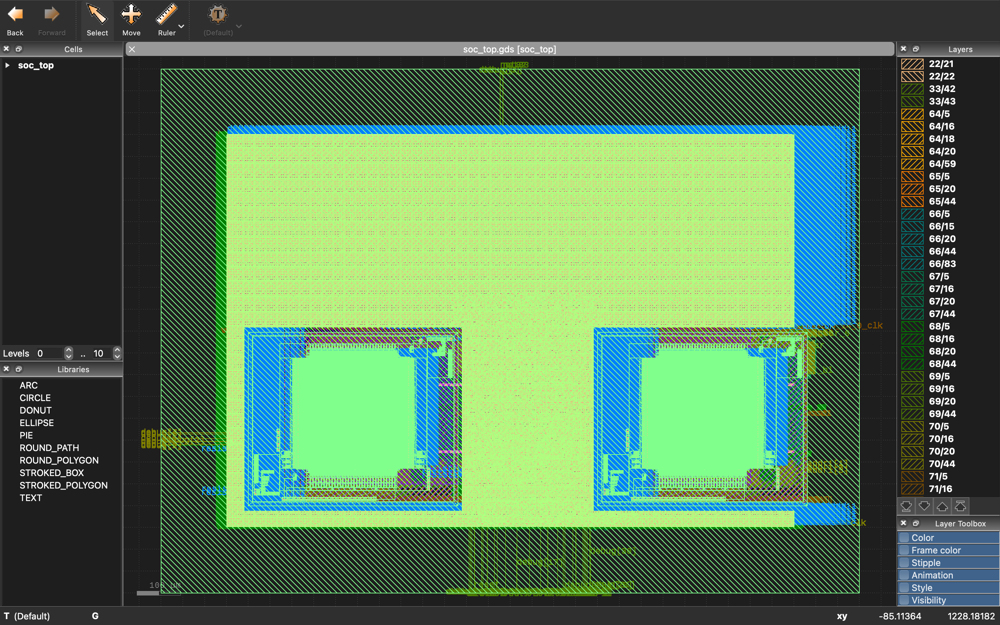

# Hierarchical RISC-V SoC Physical Design (OpenLane)

RTL-to-GDS implementation of a hierarchical RISC-V SoC using OpenLane and the SKY130 PDK.

## Design Overview

This project integrates a PicoRV32 RISC-V CPU with multiple hardware components:

- PicoRV32 CPU core
- Two SKY130 SRAM macros
- UART peripheral
- Timer peripheral
- Address decoder bus

## Design Summary

| Parameter | Value |
|-----------|------|
| CPU | PicoRV32 (RV32I RISC-V core) |
| Technology | SKY130 (130 nm) |
| Clock Domains | 1 |
| Clock Frequency | 100 MHz |
| SRAM Macros | 2 |
| Peripherals | UART, Timer |
| Standard Cells | ~6900 |
| Flow | OpenLane RTL → GDS |

## Technology

- PDK: SKY130
- Technology node: 130nm
- Flow: OpenLane RTL → GDS

## Architecture

CPU communicates with memory and peripherals through a simple memory bus.

Address map example:

| Address Range | Component |
|---------------|-----------|
| 0x0000-0x00FF | SRAM0 |
| 0x0100-0x01FF | SRAM1 |
| 0x0200-0x02FF | UART |
| 0x0300-0x03FF | Timer |

## Directory Structure
## Flow Steps

1. RTL design
2. Logic synthesis (Yosys)
3. Floorplanning
4. Placement
5. Clock Tree Synthesis (CTS)
6. Routing
7. DRC checking
8. GDS generation

## Layout

## Klayout

