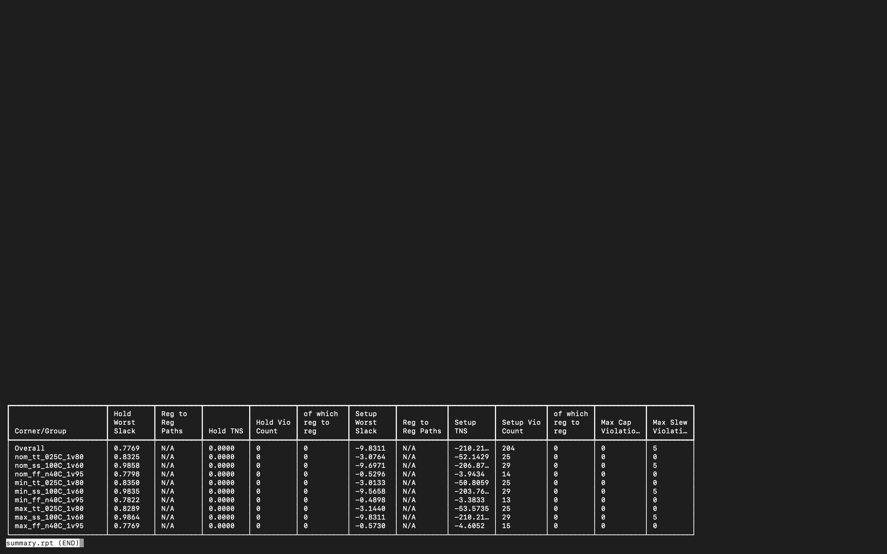
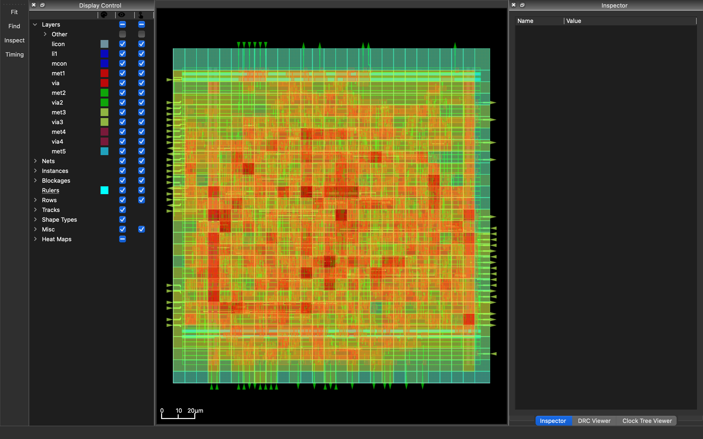

# Timing Closure Pipeline – Physical Design Project

This project demonstrates timing analysis and timing closure using the OpenLane physical design flow.

## Design Overview

The design implements a small datapath consisting of an adder, multiplier, and XOR logic block.

Original datapath:

ADD → MULT → XOR → Register

This long combinational path resulted in severe setup timing violations.

## Timing Closure Strategy

To improve timing, pipeline registers were inserted between stages:

ADD → REG → MULT → REG → XOR → REG

This reduced the critical path delay and improved timing slack.

## Flow Used

RTL → Synthesis → Floorplan → Placement → CTS → Routing → STA → DRC → LVS

Tools used:

OpenLane  
OpenROAD  
KLayout  
Magic  
Netgen

## Timing Results

| Metric | Original Design | Pipelined Design |
|------|------|------|
| Clock Period | 5 ns | 20 ns |
| Worst Negative Slack (WNS) | -9.83 ns | +2.47 ns |
| Setup Violations | 204 | 0 |
| Hold Violations | 0 | 0 |
| DRC | Passed | Passed |
| LVS | Passed | Passed |

## Timing Analysis

### Before Optimization (Original Design)

The initial design contained a long combinational path:

ADD → MULT → XOR

This resulted in severe setup timing violations.

---

### After Optimization (Pipelined Design)

Pipeline registers were inserted between stages to break the critical path.

ADD → REG → MULT → REG → XOR → REG

Timing closure was achieved with positive slack.

## Layout

Final routed layout generated using the OpenLane flow.

## Key Learning

This project demonstrates how architectural changes such as pipelining can be used to break long combinational paths and achieve timing closure.
